<div align="center">


<br>


<br><br>

<table>
<tr>

<td align="center">

</td>

<td width="35"></td>

<td align="center">

</td>

</tr>
</table>

</div>


<h2 align="left">👩‍💻 About Me</h2>


```java
public class ArshikaSingh {

    String university = "SRM University-AP";

    String degree = "B.Tech CSE";

    String mission = "Where Technology Meets Creativity";

    String[] skills = {
        "AI & ML",
        "Java",
        "MERN",
        "Blockchain",
    };
}
```

<br clear="right"/>


### 🚀 A little about me

🎓 B.Tech CSE (Big Data Analytics) @ **SRM University-AP**

📈 **CGPA:** 9.58 / 10

🤖 Learning **AI, Machine Learning & Big Data**

💻 Building with **Java • MERN • Blockchain**

🎥 Creating content where **Technology Meets Creativity**

<br clear="right"/>

<div align="center">


</div>

<br>

<h2>🌟 Journey Highlights</h2>

<div align="left">

| 🏆 Competitions | 🎥 Media & Content | 🎓 Academics |
|:---|:---|:---|
| 🥇 **TEXPO'26 Champion** | 🎬 **6.2K+ Subscriber & 6.8M+ Views** | 🎓 **CGPA:** 9.58 / 10 |
| 🥇 **Solar Rooftop Ideathon Winner** | 📺 **Featured on Republic TV** | 💯 **10 SGPA(2nd Semester)** |
| 🥉 **National Startup Day Ideathon Runner-up** | 🎤 **Public Speaker & Content Creator** | 🚀 **B.Tech CSE (Big Data Analytics)** |

</div>


## ⚙️ Tech Arsenal

<table align="center">
<tr>
<td valign="top" width="50%">

**Languages**
<br/>


**Full Stack Dev**
<br/>


</td>
<td valign="top" width="50%">

**Big Data & Analytics**
<br/>


**Blockchain & Web3**
<br/>


**Databases & Tools**
<br/>


</td>
</tr>
</table>

<div align="center">

### 📚 Currently Sharpening


</div>

## 📊 GitHub Stats

<div align="center">


</div>

## 🏆 Trophy Case

<div align="center">

</div>

## 🐍 Contribution Snake

<div align="center">


<sub>✨ Animated snake eating my contribution graph — auto-generates once the GitHub Action below is set up (see notes)</sub>
</div>

## 🚀 Featured Projects

<div align="center">

<a href="https://github.com/ARSHIKA-SINGH?tab=repositories">
  
</a>
<a href="https://github.com/ARSHIKA-SINGH?tab=repositories">
  
</a>

<sub>👆 Replace <code>your-repo-1</code> / <code>your-repo-2</code> with your actual repo names to pin real projects here</sub>

</div>

## 🤝 Let's Connect

<div align="center">

[](mailto:codedbyarshika@gmail.com)
[](https://www.linkedin.com/in/arshika-singh/)
[](https://youtube.com/@arshika_singh_07)
[](https://www.instagram.com/arshika_singh07/)

<br/>

*"Data tells the story. Blockchain keeps it honest. Code brings it to life."*

</div>


<details>
<summary>⚙️ Setup notes (click to expand) — for you, Arshika, not visitors</summary>

<br/>

1. **Stats/Typing/Trophies** — these all work automatically once this file is your profile README. No setup needed.
2. **Your animated photo** — I generated `profile-animated.svg`: your photo, circular-cropped, with a rotating dual-tone gradient ring and a pulsing "active" dot — fully self-contained (your photo is baked into the file, no external hosting needed).
   - Upload `profile-animated.svg` to the **root** of this same repo (same folder as `README.md`).
   - The README already references it as `./profile-animated.svg`, so it'll just work once both files sit side by side.
3. **Contribution Snake** — needs one small one-time setup:
   - In this repo, go to `Settings → Secrets and variables → Actions`, no secret needed.
   - Create `.github/workflows/snake.yml` with the [Platane/snk](https://github.com/Platane/snk) action (I can generate this file for you if you want).
   - It builds an `output` branch with the animated SVG automatically every 24h.
4. **Featured Projects** — swap `your-repo-1` / `your-repo-2` in the Featured Projects section with real repo names you want pinned.
5. **Colors** — everything uses a dark `tokyonight`/navy theme. Say the word if you want a different palette (e.g. dracula, radical, synthwave).

</details>
