<div align="center">


<br>


<br><br>

<table>
<tr>

<td align="center">

</td>

<td width="35"></td>

<td align="center">

</td>

<td width="35"></td>

<td align="center">

</td>

</tr>
</table>

</div>


<h2 align="left">👩‍💻 About Me</h2>


```java
public class ArshikaSingh {

    String university = "SRM University-AP";

    String degree = "B.Tech CSE";

    String mission = "Where Technology Meets Creativity";

    String[] skills = {
        "AI & ML",
        "Java",
        "MERN",
        "Blockchain",
    };
}
```

<br clear="right"/>


### 🚀 A little about me

🎓 B.Tech CSE (Big Data Analytics) @ **SRM University-AP**

📈 **CGPA:** 9.58 / 10

🤖 Learning **AI, Machine Learning & Big Data**

💻 Building with **Java • MERN • Blockchain**

🎥 Creating content where **Technology Meets Creativity**

<br clear="right"/>


</div>

<div align="center">


</div>

<br>


<h2>⚙️ Tech Arsenal</h2>

<div align="center">

<div align="center">


</div>

<br><br>


<br>


<br><br>


</div>

## 📡 Connect With Me

<div align="center">

[](mailto:codedbyarshika@gmail.com)&nbsp;&nbsp;&nbsp;
[](https://www.linkedin.com/in/arshika-singh/)&nbsp;&nbsp;&nbsp;
[](https://youtube.com/@arshika_singh_07)&nbsp;&nbsp;&nbsp;
[](https://www.instagram.com/arshika_singh07/)

</div>

## ⚡ GitHub Activity Matrix

<div align="center">


<br/><br/>


</div>

## 🐍 Contributions

<div align="center">


</div>


